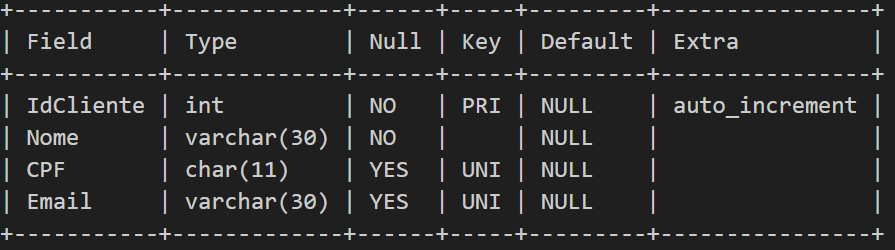
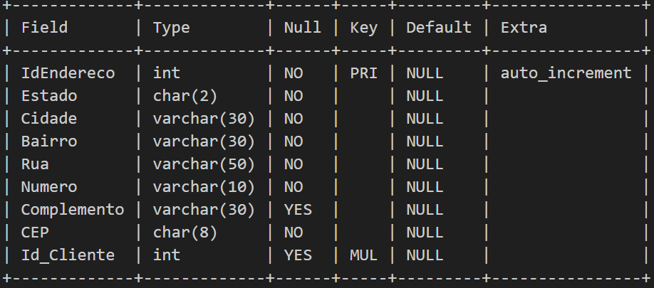
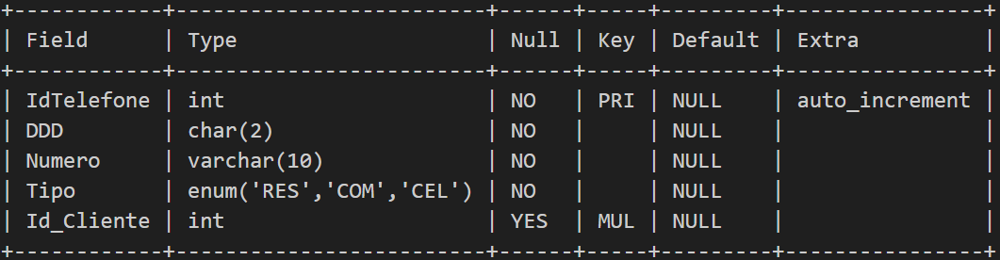
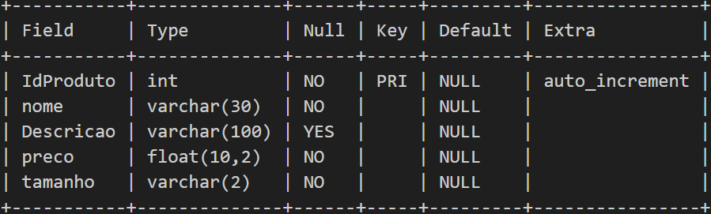
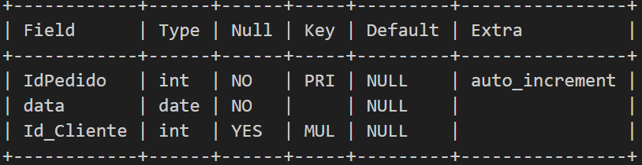
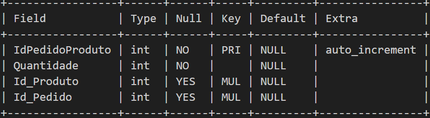

<h1>Esse é o repositório do meu projeto de Banco de Dados</h1>
A ideia desse projeto era praticar tudo que eu aprendi de SQL, na faculdade e em um curso que fiz.

Nesse projeto eu a partir de uma ideia, montei o modelo lógico e físico, fiz uma database de backup, usei triggers para automatizar os backup e deixei algumas procedures e queries feitas.

Então vamos começar minha jornada nesse projeto.

<h2>Informações do projeto</h2>

Nome do projeto: Casual Style

Objetivo do projeto: Criar um banco de dados que possa ser utilizado para armazenar informações sobre produtos, clientes e pedidos em um comercio de roupas.

Tecnologias: MySQL

Lista de requisitos:

O banco de dados deve ser capaz de armazenar informações sobre produtos, 
incluindo nome, descrição, preço e tamanho.

O banco de dados deve ser capaz de armazenar informações sobre clientes, 
incluindo nome, endereço, e-mail e telefone.

O banco de dados deve ser capaz de armazenar informações sobre pedidos, 
incluindo o cliente que fez o pedido e a data do pedido.

O banco de dados deve ser capaz de relacionar produtos a pedidos e clientes 
a pedidos.

Regras de negócio:

Cada produto deve ter um preço e um tamanho definidos.

Cada cliente deve ter um nome, endereço, e-mail e telefone únicos.

Cada pedido deve ter uma data de criação.

Um pedido pode conter vários produtos, mas cada produto só pode estar 
associado a um pedido.

<h2>Modelagem Lógica</h2>
Então em geral o modelo lógico do banco de dados ficou assim:

tabela Endereços, campos: IdEndereço(PK), Estado, Cidade, Bairro, Rua, Numero, Complemento, CEP e Id_Cliente(FK de clientes).

tabela Telefones, campos: IdTelefone(PK), DDD, Numero, Tipo e Id_Cliente(FK de clientes).

tabela Clientes, campos: IdCliente(PK), nome, cpf e email.

tabela Pedidos, campos: IdPedido(PK), data, e Id_Cliente(FK de clientes).

tabela Produtos, campos: IdProduto(PK), nome, Descrição, preço e tamanho.

tabela associativa pedido e produto, campos: IdPedidoProduto(PK), Id_Produto(FK de produtos) e Id_Pedido(FK de pedidos).

Relacionamentos
Clientes e Endereços: Obrigatoriedade(1,1) e Cardinalidade(1,1)
Clientes e Telefones: Obrigatoriedade(1,1) e Cardinalidade(1,N)
Clientes e Pedidos: Obrigatoriedade(1,0) e Cardinalidade(1,N)
Produtos e Pedidos: Obrigatoriedade(1,0) e Cardinalidade(N,N)

<h2>Modelagem Física</h2>
Onde eu já começo a usar comandos SQL para criar minhas tabelas, com seus respectivos atributos, nessa parte eu escolhi criar a primary key junto com a tabela para usar o AUTO_INCREMENT, já a FK eu criei o atributo dela, porém só as defini depois, principalemente para deixar a constraint com um nome que eu escolhi.

Cliente -

Endereço -

Telefone -

Produto -

Pedido -

Tabela associativa de Pedido e Produto -

